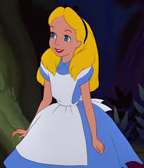
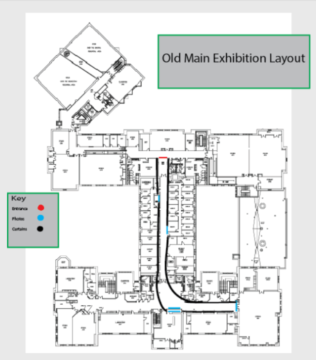
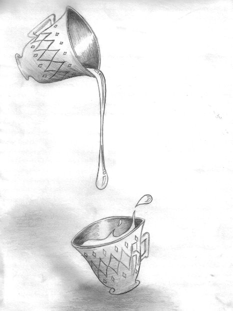
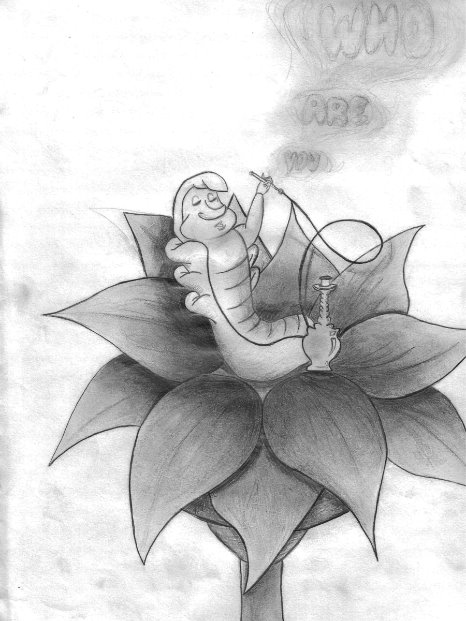
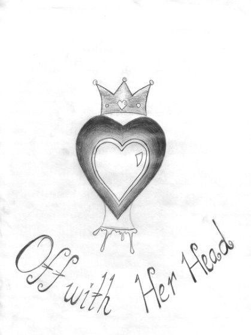
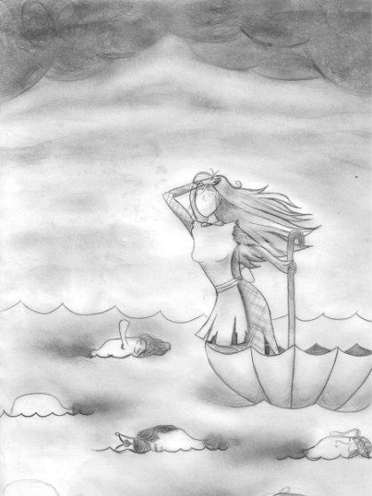
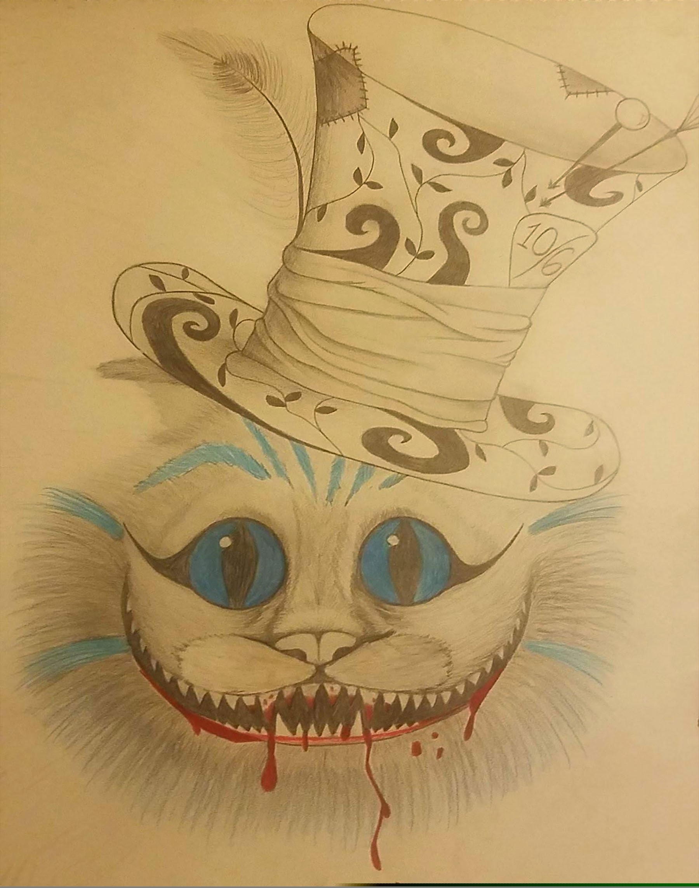

# exhibition
<!DOCTYPE html>
<html>
<head>
	<meta charset="UTF-8">
	<meta name="viewport" content="width=device-width,initial=scale=1.0">
	<title>Exhibiton Walk Through</title>
		
</head>
<body>

	<h1>
Alice In Wonderland Series Gallery
</h1>

	

For this exhibition we will be focusing on 5 pieces that surround the Alice in Wonderland world. There will be four black and white pieces leading to the gallery title piece, "We're All Mad Here". These works pay homage to both the cartoon and live action version fo the classic Disney movie. We will be hosting this exhibition on Old Main's third floor at Wayne State University.

	

	

	

The exhibit is meant to be viewed starting from the music department, coming down the hall to the digital studio, then ending at the front of the painting studio. Behind each piece along the walls would be a full length black curtain to cover the walls and any doors. We'll use black to give this dark illusion that your going further and further down the rabbit hole.

	

The first two pieces are tributes to the beginning of the story, when Alice meets our Wonderland friends at the Mad Hatter's tea party. So we start at the beginning of the hall that goes from the music department to the digital studio, by showcasing the teacups themselves on the right side. This piece will be displayed in the smallest framing at 6" x 6", because Alice is small after she drank from the "Drink Me" vial to crawl through the hole to Wonderland. Then on the other side of the hallway approximately 10 feet down we have the classic version of the caterpillar to ask the age old, important question, "Who Are You?" This is a little bigger at 9"x12" because while Alice is still small, so is the caterpillar. These two pieces are more small and innocent in depiction, emulating the viewpoint of a child. While the exhibit is titled "We're All Mad Here", it gives the narrative that we as adults are all mad, and as you move forward the innocent, small viewpoint goes away and the more gory, maddening side of society or your surroundings becomes the main point.

	

	
<caption>
"Teacups", Whitney Dean, 2019. Materials: Graphite. Dimensions: 6"x6"
</caption>

	

	
<caption>
"Who Are You", Whitney Dean, 2019. Materials: Graphite. Dimensions: 9"x12".
</caption>

	

	

After coming down the hall you come into the tall lobby outside of the digital studio. We'll cut off the drawing hallway with more ceiling to floor black curtains to keep the audience's head speace into rabbit hole. When you look above the doors of the digital studio, you see the piece "Off With Her Head" depicting a grotesque piece of the Queen of Hearts with her own head cut off. This piece is much larger, apporximately 4'x4'and will sit only a couple inches from the ceiling. This piece is special like teacup is in the sense that it doesn't depict the a version made by the movies, but my own version where the head of the Queen is a black encased heart itself. From this piece we'll have the blood from the Queen's neck coming down the wall to our next piece that's the same size titled, "Alice's Umbrella Boat". Here we have a faceless Alice lost in the water like she was in the cartoon, but instead of water she's in a sea of blood with heads that the Queen has offed, paying tribute to the moat of heads that surround the Queen of Hearts palace in the live action movie. You even see the King's head is in the blood sea like the movie, showing we are in full madness. We also have the smoke from the caterpillar now taking over the sky and the question "Who Are You" hanging over Alice's head. So even though we've gone through more and are grown, we still don't know who we are and the madness continues. Having everything tie together to tell a story felt imperative to which pieces were chosen. So going with that narrative, when you see this in the exhibit the blood from the Queens neck is what her river of heads run in.

	

	
<caption>
"Off With Her Head", Whitney Dean, 2019. Material: Graphite. Dimensions:4'x4'.
</caption>

	

	
<caption>
"Alices Umbrella Boat", Whitney Dean, 2019. Material: Graphite. Dimensions:4'x4'.
</caption>

	

	

	

 From here, we move with Alice  in the same direction she's pointed to and turn left towards the painting studio to see the final piece that the exhibition was titled for, "We're All Mad Here". Here we have two iconic parts of the story molded into one. Starting with the head of a fan favorite character, we have the Chreshire Cat wearing the Mad Hatter's hat, both depictions from the second movie. This piece is the largest piece at 8'x11' hanging in the center of the wall. This is the only piece with color, highlighting the blue of his fur but also the red of the blood. The viewer is left with the question, "Did he bite her head off or is this from something else?" Did the Chreshire Cat bite the Queen's head and save Alice, or was he his regular mischivous self and play both sides, biting the heads off of everyone else for the Queen, only to turn on her too? In a world where we're all a little mad, nothing is out of the realm of possibility. As we go down the rabbit hole of this exhibition and we reach the end we've fully enveloped ourselves into the idea that we've now gone from small, young, innocent Alice to full madness Alice with gore, consquences and all.

	

	
<caption>
"We're All Mad Here", Whitney Dean, 2019. Materials: Graphite and colored pencils. Dimensions: 8'x11'.
</caption>

	

This will conclude the exhibition. While the piece hangs at the center of the wall, we leave room for the doors to the painting studio, which will be set up for refreshments in the theme of a tea party. Guests can discuss the exhibition and enjoy themselves as they wrap up their journey down the rabbit hole, so to speak.

</body></html>
